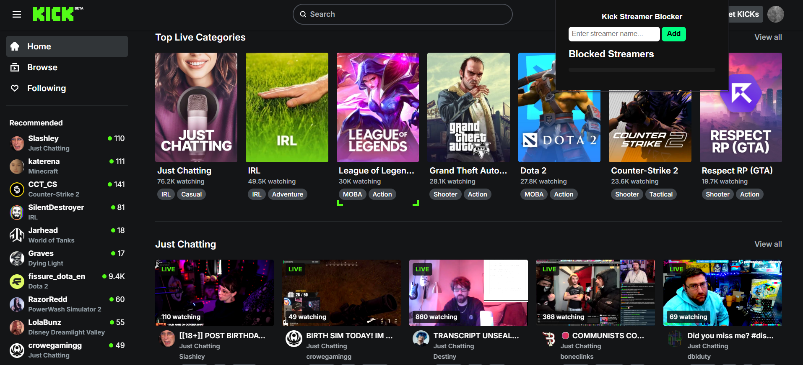
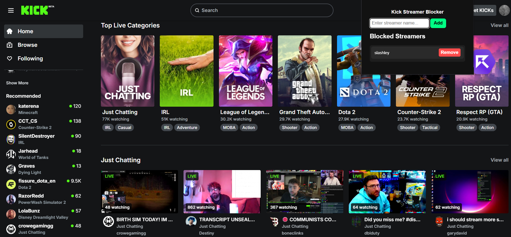

# Kick Streamer Blocker

Hide unwanted streamers from Kick’s Home and Browse pages.  

## Features
- Block unwanted streamers globally
- Modern, responsive popup
- Dark mode interface
- Storage Sync with limit check
- Works on dynamic Kick pages

## How to Install
1. Download the repository as ZIP or clone.
2. Open Chrome → `chrome://extensions/` → Enable Developer Mode
3. Click "Load unpacked" → Select the project folder
4. Start blocking streamers!

